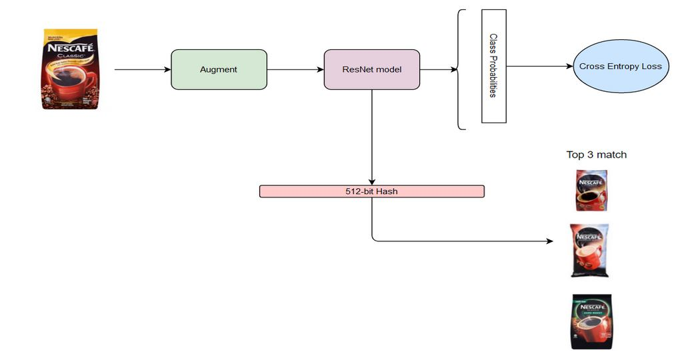
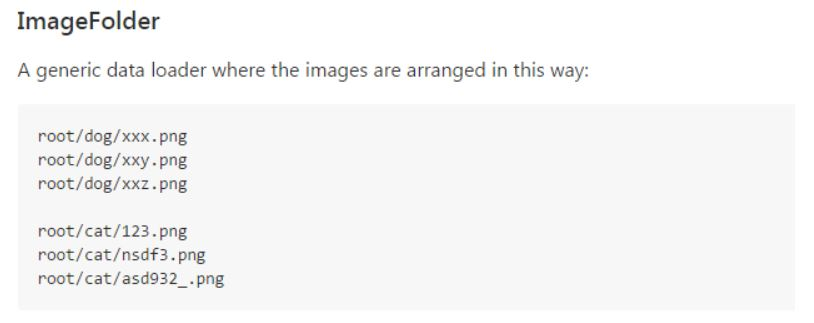
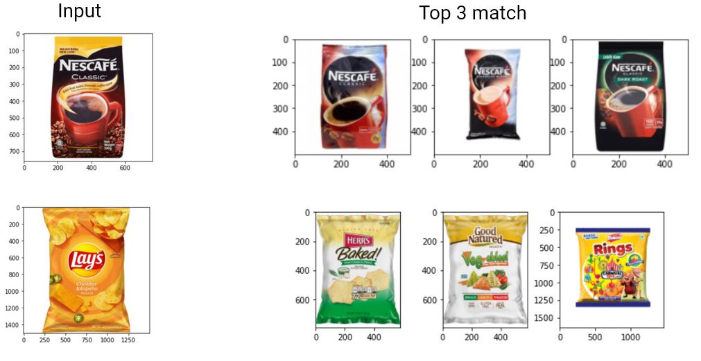
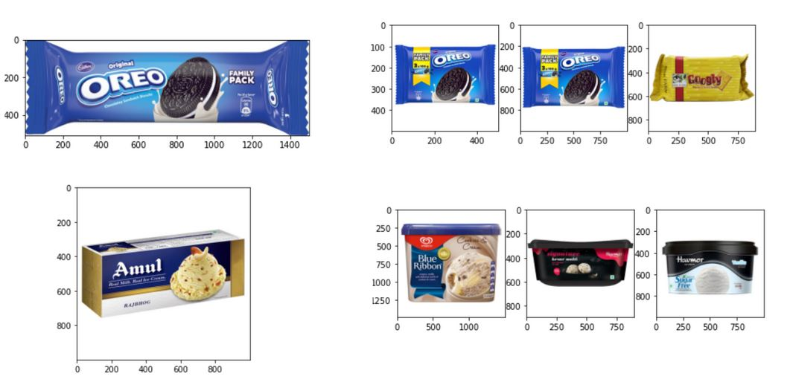
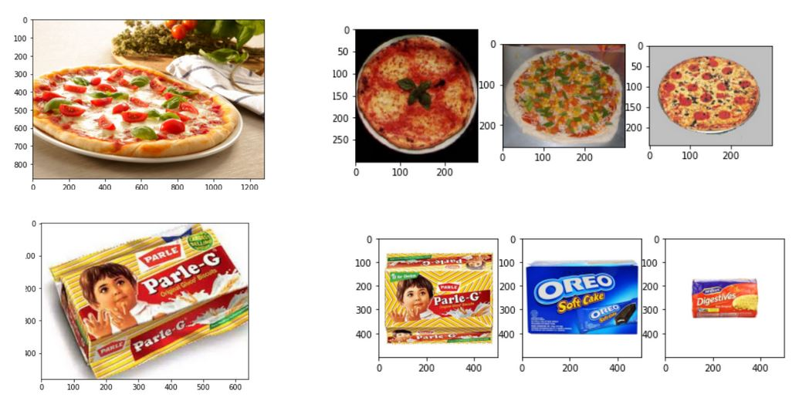

# Deep Image Hashing

Quick query search through image hash of grocery products. 

Done as a part of summer remote internship at Digital Horizons.

## Dependencies

1. Python 3.6+
2. Numpy
3. PyTorch
4. Matplotlib
5. Pillow
6. Tqdm
7. Annoy

Run the following command to install these dependencies 
```
    pip install -r requirements.txt
```
## Pipeline



## Dataset details
Grocery porducts provided by Digital Horizons was used. It had 10 different products ranging from soaps to biscuits. The organization of the data was obliging the Image Folder structure as seen below. 



Since the given dataset was imbalanced, we do class rebalancing to make all the classes have equal number of images.

## Usage

```
    python main.py
```
### Notes about some parameters in [main.py](main.py)
* isTrain - Whether to train the model 
* isSaveHash - Whether to run the trained model through the entire dataset inorder to save the hash
* Normalization in TRANSFORM_IMG might have to change depending on your data. The one that is used has mean and standard deviation of ImageNet dataset.

## Results





## Suggestions for improvement
1. More brand specific data rather than product specific data.
2. Intelligent class rebalancing. 
3. Ensemble with different DL models.